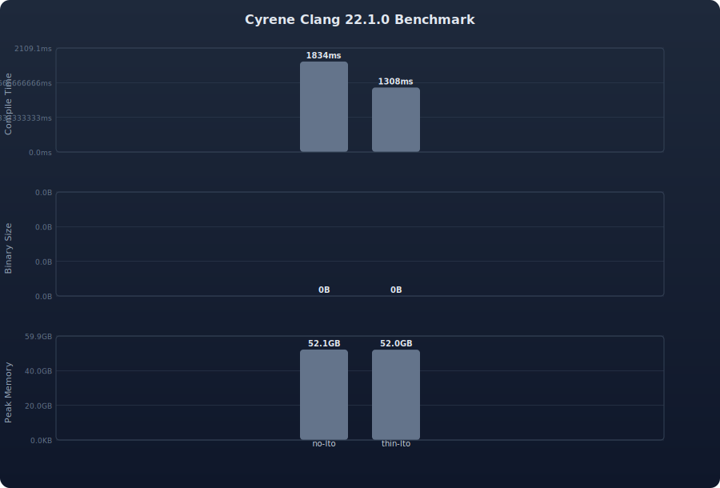

# Cyrene Clang

[](LICENSE)
[](https://github.com/naidrahiqa/cyrene_clang/releases)
[](https://github.com/naidrahiqa/cyrene_clang/actions/workflows/build.yml)

A custom LLVM/Clang toolchain optimized for Android kernel compilation. Built with PGO, ThinLTO, and BOLT for maximum performance.

## Features

| Feature | Details |
|---|---|
| **PGO** | 2-stage IR-based Profile-Guided Optimization |
| **ThinLTO** | Applied to the toolchain itself for faster, leaner binaries |
| **BOLT** | Binary Optimization and Layout Tool for 5-15% additional speedup |
| **Polly** | Loop vectorization optimizer, usable via `-mllvm -polly` |
| **Memory-aware jobs** | Auto-detects RAM and scales parallel jobs |
| **LTO modes** | Thin (default), Full, or Off — configurable via `LTO_MODE` |
| **Ccache aggressive** | Compression + sloppiness for faster rebuilds |
| **Build profiling** | Per-stage timing in `build_metadata.json` |
| **Targets** | AArch64, ARM (32-bit), X86 (host tools) |
| **Kernel support** | 4.14 through 6.x (GKI + legacy trees) |
| **Auto-sync** | Weekly rebuild from LLVM `main` |
| **Distribution** | GitHub Releases + `clang-version.txt` + `clang_notes.txt` manifests |
| **Telegram notify** | Build status pushed to Telegram channel |

## Benchmark

Auto-generated benchmark comparing **compile time**, **binary size**, and **peak memory** across different LTO modes:



<details>
<summary>Raw Results (JSON)</summary>

```json
benchmark/results.json
```

</details>

### Run Benchmark Locally

```bash
# Run benchmark with 5 iterations
RUNS=5 bash scripts/benchmark.sh

# Output:
# - benchmark/results.json   (compile time, binary size, peak memory)
# - benchmark/chart.svg      (3-panel visualization)
```

## Quick Start

### One-liner install (recommended)

```bash
bash <(wget -qO- https://raw.githubusercontent.com/naidrahiqa/cyrene_clang/main/get_clang.sh)
```

### Manual install

```bash
# Get the latest manifest
wget https://raw.githubusercontent.com/naidrahiqa/cyrene_clang/main/clang-version.txt

# Download the toolchain
DOWNLOAD_URL=$(grep DOWNLOAD_URL clang-version.txt | cut -d= -f2)
wget "$DOWNLOAD_URL"

# Extract
mkdir -p $HOME/toolchains
tar -I zstd -xf cyrene-clang-*.tar.zst -C $HOME/toolchains/

# Fix ld symlink (if needed)
cd $HOME/toolchains/cyrene/bin
ln -sf $(which ld.lld) ld
```

## Kernel Integration

```bash
export PATH="$HOME/toolchains/cyrene/bin:$PATH"

make -j$(nproc) \
  O=out \
  ARCH=arm64 \
  CC=clang \
  LD=ld.lld \
  AR=llvm-ar \
  NM=llvm-nm \
  STRIP=llvm-strip \
  OBJCOPY=llvm-objcopy \
  OBJDUMP=llvm-objdump \
  CLANG_TRIPLE=aarch64-linux-gnu- \
  CROSS_COMPILE=aarch64-linux-gnu-
```

### Unified Kernel Build Script

```bash
# Auto-detect kernel version and apply correct flags
bash scripts/kernel-build.sh <kernel-dir> --defconfig=<name> --lto=auto

# Examples
bash scripts/kernel-build.sh ~/kernel/msm-4.19 --lto=off
bash scripts/kernel-build.sh ~/kernel/msm-5.15 --defconfig=vendor/sdm845_defconfig
bash scripts/kernel-build.sh ~/kernel/android-mainline --lto=thin
```

### Kernel LTO Integration

```bash
source scripts/kernel-lto.sh [kernel-source-dir]
make -j$(nproc) O=out ARCH=arm64 ...
```

## Repository Structure

```
cyrene-clang/
├── .github/
│   ├── workflows/
│   │   ├── build.yml           # CI/CD pipeline
│   │   ├── lint.yml            # ShellCheck linting
│   │   └── sync-patches.yml    # Auto-sync from LLVM stable
│   ├── ISSUE_TEMPLATE/
│   │   ├── bug_report.md
│   │   └── feature_request.md
│   └── PULL_REQUEST_TEMPLATE.md
├── config/
│   ├── build.conf              # Default build configuration
│   └── kernels/
│       ├── 4.x.conf            # Kernel 4.x settings
│       ├── 5.x.conf            # Kernel 5.x settings
│       └── 6.x.conf            # Kernel 6.x settings
├── contrib/                    # Community contributions
├── docker/                     # Docker build environment
├── docs/
│   ├── CHANGELOG.md
│   ├── CONTRIBUTING.md
│   ├── SKILL.md
│   └── TROUBLESHOOT.md
├── patches/                    # Custom LLVM patches
├── scripts/
│   ├── benchmark.sh            # Benchmark runner (compile time, binary size, memory)
│   ├── build.sh                # Main build script
│   ├── check-compat.sh         # Compatibility validator
│   ├── generate-chart.py       # SVG chart generator for benchmark results
│   ├── install.sh              # Legacy installer
│   ├── kernel-build.sh         # Unified kernel build (4.x-6.x)
│   ├── kernel-lto.sh           # Kernel ThinLTO helper
│   ├── notify.sh               # Telegram notifications
│   ├── package.sh              # Package + manifest generator
│   ├── patch.sh                # Patch application
│   └── sync-patches.sh         # LLVM stable sync
├── tests/
│   └── test-build.sh           # Build tests
├── .editorconfig
├── .gitignore
├── Dockerfile
├── LICENSE                     # Apache-2.0
├── Makefile                    # Common tasks
├── README.md
├── VERSION                     # Version tracking
└── get_clang.sh                # One-liner installer
```

## Building from Source

```bash
git clone https://github.com/naidrahiqa/cyrene_clang
cd cyrene_clang
make build  # or: bash scripts/build.sh
```

### Make Commands

| Command | Description |
|---|---|
| `make build` | Full build with PGO + BOLT |
| `make build-simple` | Quick build without PGO |
| `make lint` | Run ShellCheck on scripts |
| `make test` | Run build tests |
| `make bench` | Run benchmark (compile time, binary size, memory) |
| `make bench-quick` | Run benchmark with 1 iteration |
| `make bench-full` | Run benchmark with 5 iterations |
| `make docker-build` | Build in Docker |
| `make clean` | Remove build artifacts |

### Environment Variables

| Variable | Default | Description |
|---|---|---|
| `LLVM_BRANCH` | `llvmorg-22.1.0` | LLVM branch or tag to build |
| `ENABLE_PGO` | `true` | Enable 2-stage PGO build |
| `ENABLE_BOLT` | `true` | Enable BOLT post-build optimization |
| `PGO_WORKLOAD` | `sqlite` | PGO workload: `sqlite` (fast) or `kernel` (accurate) |
| `LTO_MODE` | `Thin` | LTO mode: `Thin`, `Full`, or `Off` |
| `ZSTD_LEVEL` | `19` | Zstd compression level (1-22) |
| `JOBS` | auto | Parallel build jobs (auto-detected from RAM) |
| `CLANG_VENDOR` | `Cyrene Clang` | Vendor string in clang version output |
| `INSTALL_DIR` | `~/toolchains/cyrene` | Where to install the toolchain |

### Benchmark Environment Variables

| Variable | Default | Description |
|---|---|---|
| `CYRENE_DIR` | `~/toolchains/cyrene` | Path to installed Cyrene Clang toolchain |
| `KERNEL_SOURCE` | auto-clone | Kernel source directory for benchmark |
| `RUNS` | `3` | Number of iterations per configuration |
| `ARCH` | `arm64` | Target architecture |

## Docker Build

```bash
# Build in Docker container
make docker-build

# Run build inside Docker
make docker-run
```

## Adding Custom Patches

1. Generate a patch from your LLVM working tree:
   ```bash
   git -C llvm-project format-patch -1 HEAD
   ```
2. Move it to `patches/` with a descriptive name:
   ```
   patches/0001-fix-arm64-inline-asm.patch
   ```
3. Push — the workflow auto-triggers on changes to `patches/`.

## Compatibility Check

```bash
# Check toolchain only
make test-compat

# Or directly
bash scripts/check-compat.sh ~/kernel/msm-5.15
```

## Documentation

- [Changelog](docs/CHANGELOG.md) — Version history
- [Contributing](docs/CONTRIBUTING.md) — How to contribute
- [Troubleshooting](docs/TROUBLESHOOT.md) — Common issues and fixes

## License

Licensed under the [Apache License, Version 2.0](LICENSE).
